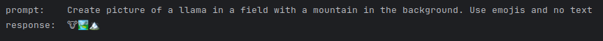

# Installation steps

### step 1
Install ollama to your computer (ubuntu):

```curl -fsSL https://ollama.com/install.sh | sh```

### step 2

```https://github.com/ollama/ollama```

select your model from github list. Large models need more system RAM

```ollama run <model_name>``` 

I used "llama2" model in my testing.

### step 3

Run opens cli interface where you can interact with the model.
```/bye``` to exit from cli interface.

```ollama help``` to see all available commands.

### step 4
install ollama python package.
```pip install ollama```

Now you can try the main.py example.
```python main.py```



### Advanced example
ModelFile includes an example how to create a new model.
Below example creates a mymodel using ModelFile.
For parameter tweaking please see https://github.com/ollama/ollama/blob/main/docs/modelfile.md

```ollama create mymodel -f ModelFile```